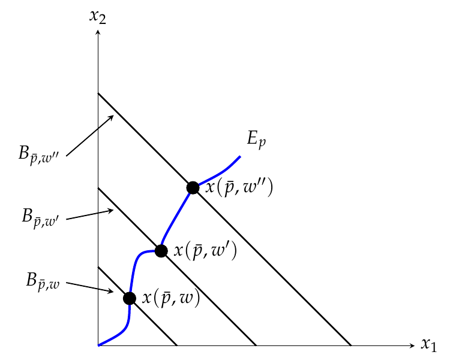
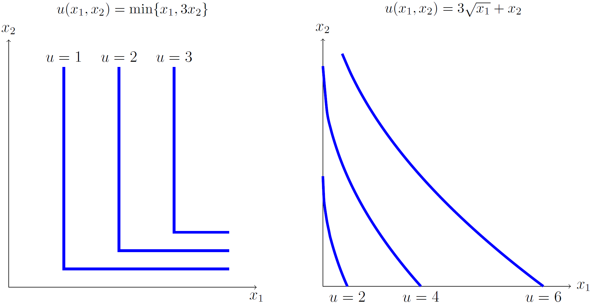
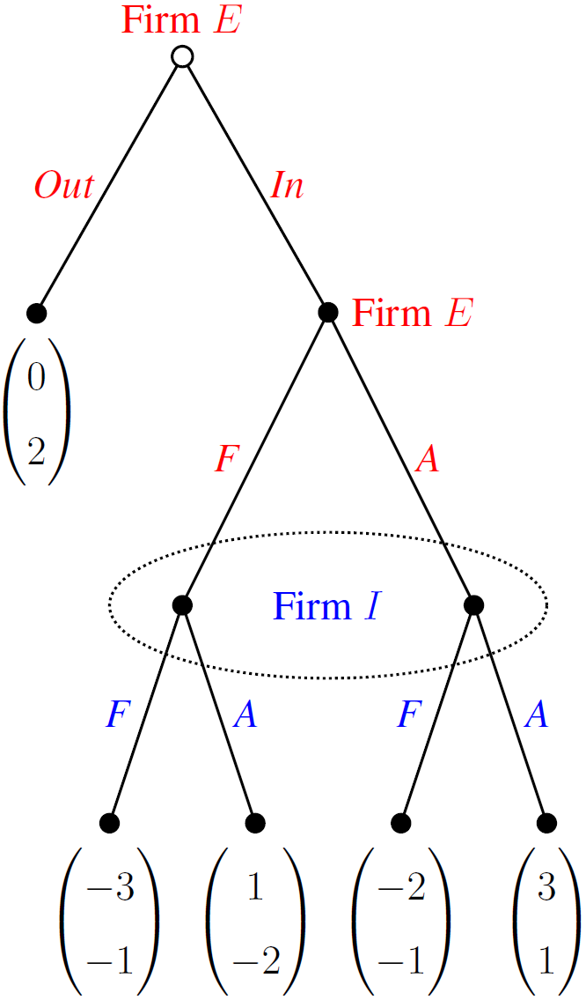

# Using TikZ and PGF to Plot in LaTeX
This repository shares TikZ and PGF coding (written by Ian He and JaeSeok Oh) to create plots in LaTeX. To see the coding for any plot in the following sections, please click the figure. The hyperlink will lead you to our corresponding tex file.

**Contact:**

:disguised_face: Ian: ianho0815@outlook.com.
  
:sunglasses: JaeSeok: jaeseok@ou.edu.

Comments are always welcomed!

## Introduction
TikZ and PGF are languages commonly used in [LaTeX](https://www.latex-project.org/) for producing vector graphics, with lots of wonderful features including the drawing of points, lines, arrows, and shapes. More precisely, PGF is a lower-level language, while TikZ is a set of higher-level macros that use PGF.

To replicate the plots we create in the following sections, you must type the codes below in your LaTeX preamble.
```latex
\usepackage{graphicx, float, caption, subcaption, tzplot, asymptote, pgfplots}
\pgfplotsset{compat=1.18}
\usetikzlibrary{calc, calligraphy, decorations.pathreplacing, patterns, shapes.misc}

\usepackage{xcolor}
\definecolor{main}{RGB}{0,166,82}
\definecolor{second}{RGB}{32,178,170}

\usepackage{amsmath, amssymb, bbm, dutchcal}
```
**Note:**
 * The `graphicx` package ([documentation](https://ctan.org/pkg/graphicx)) provides some useful optional arguments to the `\includegraphics` command.
 * The `float` package ([documentation](https://ctan.org/pkg/float)) improves the interface for defining floating objects, such as figures and tables. By default, we can use something `[h]` (here), `t` (top), and `b` (bottom) to determine the figure positioning; however, these positioning options are not strong --- LaTeX still has some flexibility to select the best position in its mind. To precisely fix the position of a floating objects, we have to use the parameter `[H]` from `float`.
 * The `caption` ([documentation](https://ctan.org/pkg/caption)) and `subcaption` ([documentation](https://ctan.org/pkg/subcaption)) packages allow us to customize the captions and subcaptions in floating environments like figure, table, subfigure, and subtable.
 * The `tzplot` package ([documentation](https://ctan.org/pkg/tzplot)) provides some TikZ-based macros to make it easy to draw graphs. For example,
   * The `\tzaxes` command draws the *x*-axis and the *y*-axis quickly.
   * The `\tzfn` command plots a function over a specified domain.
   * The `\tzbezier` command draws a [Bézier curve](https://en.wikipedia.org/wiki/B%C3%A9zier_curve) with one or two control points from the first coordinate to the last coordinate.
   * The `\tzdot` and `\tzcdot` commands add a label to a dot (with two optional patterns and two optional sizes).
 * The `asymptote` package ([documentation](https://ctan.org/pkg/asymptote)) provides a lot of commands for 2D and 3D high-quality level technical drawing.
 * The `pgfplots` package ([documentation](https://ctan.org/pkg/pgfplots)) allows us to draw high-quality function plots. In particular, it supports axis scaling, axis ticks custimization, axis labels custimization, legend entries, etc. Note that `pgfplots` has been written with backwards compatibility; thus, new features occasionally lead to a different behavior. Therefore, we suggest to activate explicitly new features or bugfixes by writing `\pgfplotsset{compat=1.18}` in your preamble, where `compat=1.18` is the highest compatibility level nowadays. The lowest level is `compat=1.3`.
 * `asymptote` and `pgfplots` provide basic functionalities and load the `tikz` and `pgf` packages ([documentation](https://www.ctan.org/pkg/pgf)) automatically. For special features, special libraries must be included. The libraries we use include
   * `calc` (making complex coordinate calculations);
   * `calligraphy` (enabling calligraphic style drawings);
   * `decorations.pathreplacing` (defining decorations that replace the to-be-decorated path by another path);
   * `patterns` (providing different patterns for filling in area);
   * `shapes.misc` (defining additional shapes).
 * The `xcolor` package ([documentation](https://ctan.org/pkg/xcolor)) allows us to select colors for hyper references, url links, plotting figures, etc. The basic color (e.g., blue and red) can be used directly by typing `\color{color_name}` to use it in the document. If additional colors are needed, we suggest to name the color first (for convenient future use) by the `\definecolor{new_color_name}{RGB}{#,#,#}` command, and then use the `\color{new_color_name}` command. The [RGB model](https://en.wikipedia.org/wiki/RGB_color_model) is our preferred model, but other models (e.g., `rgb`, `HTML`, `HSB`, etc.) are also available. There are some good websites to search for color codes:
   * For RGB model, see [here](https://www.rapidtables.com/web/color/RGB_Color.html).
   * For HTML model, see [here](https://htmlcolorcodes.com/).
 * The `amsmath` package ([documentation](https://ctan.org/pkg/amsmath)) is a principal package for mathematical typesetting. Once `amsmath` is loaded, the packages `amsbsy` (for bold symbols), `amsopn` (for operator names) and `amstext` (for text embedded in mathematics) are also loaded.
 * The `amssymb` package provides an extended symbol collection, especially including some additional binary relation symbols (e.g., `\boxdot`, `\boxplus`, `\boxtimes`). Something noteworthy is that this package provides the `\mathbb{ }` command for producing blackboard bold characters.
 * The `bbm` package ([documentation](https://ctan.org/pkg/bbm)) provides blackboard variants of characters in math mode. The command is `\mathbbm{ }`, which produces the blackboard bold characters slighly different from those produced by `\mathbb{ }`.
 * The `dutchcal` package ([documentation](https://ctan.org/pkg/dutchcal)) reworks the mathematical calligraphic font ESSTIX13 in the package `esstix` ([documentation](https://ctan.org/pkg/esstix)) and adds a bold version.

## Functions

### Best Response Function
[](./Coding/Best_Response_with_Continuous_NE.tex)

### Cobb-Douglas Production Function
[](./Coding/Dynamics_of_Solow_Model.tex)

### Engel Function
[](./Coding/Engel_Function.tex)

### Indifference Curves from Different Utility Functions
[](./Coding/Indifference_Curve_1.tex)

[](./Coding/Indifference_Curve_2.tex)

[](./Coding/Indifference_Curve_3.tex)

### Leontief Production Function
[](./Coding/Leontief_Production_Function.tex)

## Shaded Areas

### Budget Set of a Consumer in a Two-Commodity Market
[](./Coding/Budget_Set.tex)

### Input Requirement Set and Isoquant Curve
[](./Coding/Input_Requirement_Set.tex)


## Game Trees

### Matching Pennies
[](./Coding/Matching_Pennies_with_Nature.tex)

### Entry Deterrence Game
<div id="Entry_Deterrence_Game">
  <a href="./Coding/Entry_Deterrence_Game.tex">
    &nbsp;&nbsp;&nbsp;&nbsp;
  </a>
  <a href="./Coding/Modified_Entry_Deterrence_Game.tex">
    
  </a>
</div>

### Predation Game
[](./Coding/Predation_Game_with_Weak_PBE.tex)

### Special Games
[](./Coding/Forget_Others_Move.tex)

[](./Coding/Forget_Own_Move.tex)

[](./Coding/Pricing_under_Uncertainty.tex)


## Models

### Ramsey Growth Model (or Ramsey-Cass-Koopmans Model)
<div id="Ramsey_Models">
  <a href="./Coding/Ramsey_Model.tex">
    &nbsp;&nbsp;&nbsp;&nbsp;
  </a>
  <a href="./Coding/Ramsey_Model_with_Government.tex">
    
  </a>
</div>
